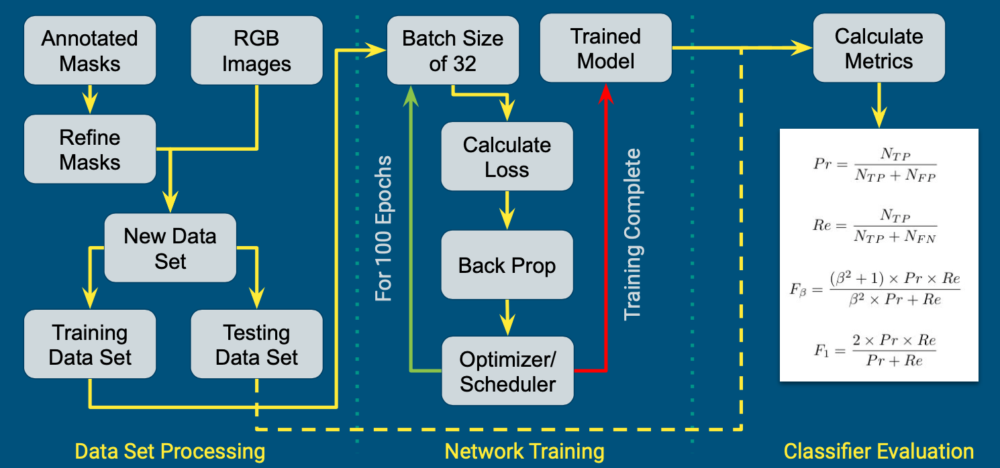
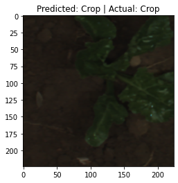
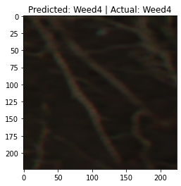
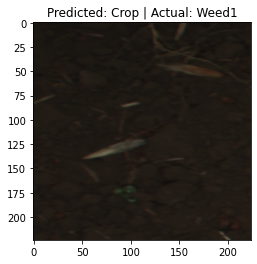
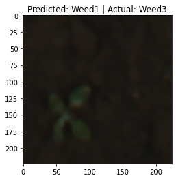

# Crop Weed Classification

This project uses image data to distinguish desired crops from unwanted weeds. The classifier used is ResNet18 and the data comes from the [Sugar Beets 2016 Dataset](https://www.ipb.uni-bonn.de/data/sugarbeets2016/). This repository contains the [scripts](https://github.com/mepix/CropWeedClassification/tree/main/scripts) necessary to preprocess the dataset and the notebooks necessary to train the classifier. You will need to prepare the dataset yourself, but the notebooks can be run in Colab:

[](https://colab.research.google.com/github/mepix/CropWeedClassification/blob/main/CropCNN.ipynb)



## Results

The classifier is far from perfect, but this project helped me learn a lot about data processing, unevenly distributed data sets, and PyTorch. Performance metrics can be viewed in the [reports and presentations](https://github.com/mepix/CropWeedClassification/tree/main/reports%2Bslides).






## Repository Structure

- scripts: python files for preprocessing the input dataset
- data: folder where the data resides for the preprocessing functions (omitted by `.gitignore`, you will need to create your own)
- pytorch-vision: open source helper functions
- img: supporting images
- reports+slides: final report and slides for EE244

## References

### Data Sources

This project uses images from the [Sugar Beets 2016 Dataset](https://www.ipb.uni-bonn.de/data/sugarbeets2016/). The data can be downloaded [here](https://www.ipb.uni-bonn.de/datasets_IJRR2017/). Please cite their work! :)

```
@article{chebrolu2017ijrr,
title = {Agricultural robot dataset for plant classification, localization and mapping on sugar beet fields},
author = {Nived Chebrolu and Philipp Lottes and Alexander Schaefer and Wera Winterhalter and Wolfram Burgard and Cyrill Stachniss},
journal = {The International Journal of Robotics Research},
year = {2017}
doi = {10.1177/0278364917720510},
}
```

### Developer References

- [PyTorch Vision](https://github.com/pytorch/vision)
- [PyTorch Vision Helper Functions](https://discuss.pytorch.org/t/modulenotfounderror-no-module-named-engine/59564)
- [Example: Image Segmentation in Cancer Patients](https://seymatas.medium.com/pytorch-image-segmentation-tutorial-for-beginners-i-88d07a6a63e4)
- [Example: Semantic Segmentation with PyTorch](https://learnopencv.com/pytorch-for-beginners-semantic-segmentation-using-torchvision/)
- [Tutorial: Object Detection with TorchVision](https://pytorch.org/tutorials/intermediate/torchvision_tutorial.html)
- [Tutorial: Image Classification with PyTorch](https://towardsdatascience.com/a-beginners-tutorial-on-building-an-ai-image-classifier-using-pytorch-6f85cb69cba7)
- [Using Google Colab with GitHub](https://colab.research.google.com/github/googlecolab/colabtools/blob/master/notebooks/colab-github-demo.ipynb#scrollTo=8QAWNjizy_3O)
